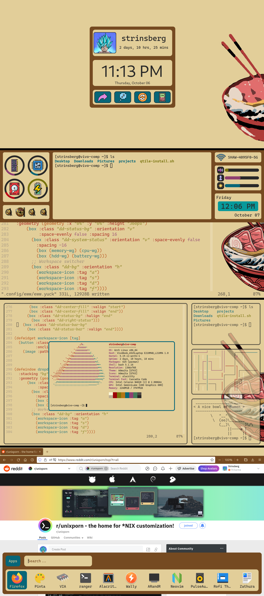

# A Nice Bowl of Ramen dots

Some dots for my "A Bowl of Ramen" r/unixporn [post](https://www.reddit.com/r/unixporn/comments/y2ehbi/qtile_a_bowl_of_ramen/). This is not all of my dots,
but a selection of those that are relevant to the screenshot.

**Note**: This is not a full collection of all the dots required for the desktop. It is NOT intedended to serve as something you can clone and
get my exact desktop, but a collection of information that can allow people to see how I set things up. **These are given as is and I do not accept
any responsibility for issues arising from their use**. Please DO NOT submit issues for the dots.

## Background and Icons

The background and icons are obtained/modified from different sources. Because they are licensed for personal use or are my personal modifications to
someone elses work I am not including them in the repo. This is another reason these dots are not inteded to be used directly.
- [Original Background](https://www.wallpaperflare.com/ramen-waves-chopstick-chopsticks-eggs-japanese-food-the-great-wave-off-kanagawa-wallpaper-ysomc)
- [Icons](https://www.flaticon.com/)

## Eww widgets

The widgets are all created with [eww](https://github.com/elkowar/eww). The dots for these should be used for inspiration or as a guide to build your own.
Copying them without adding icons and dependencies for the scripts will cause problems and they are mostly sized and positioned for my 11" laptop with a
1366x768 resolution.

## Scripts

Some simple scripts are available, again as a way of seeing what I did, but the full functionality of the window manager and widgets may be both in
scripts and hardcoded commands. So finding the exact place that I make something happen might be difficult. I also had some issues with Qtile not running
scripts or commands as expected, so a few things might be kind of hacked together to get as close to the functionality I wanted.

## Acknowledgment

Some of the dots were built on what was provided in other places. The [EndeavourOS](https://endeavouros.com/)
Qtile community edition was the base for a number of things. I did eventually
setup my own install script from a clean EndeavourOS cli install, but without the community edition that would not have been possible. Some of the dots for
things other than Qtile also originated with the same install. I also got inspiration, and possibly some configs to build on, from [adi1090](https://github.com/adi1090x) for my rofi launchers. And of course there are lots of little bits and pieces learned/inspired/taken from posts and dots
on [r/unixporn](https://www.reddit.com/r/unixporn/) which makes this kind of customization possible.
Thanks to all these people/communities for sharing their work.
